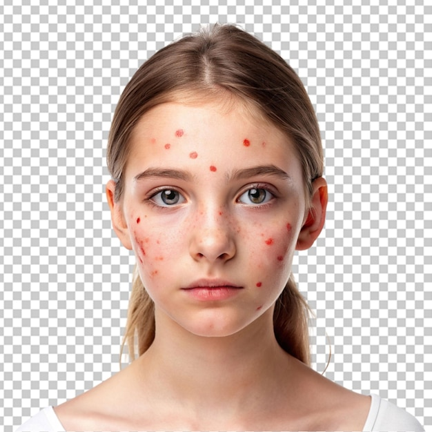
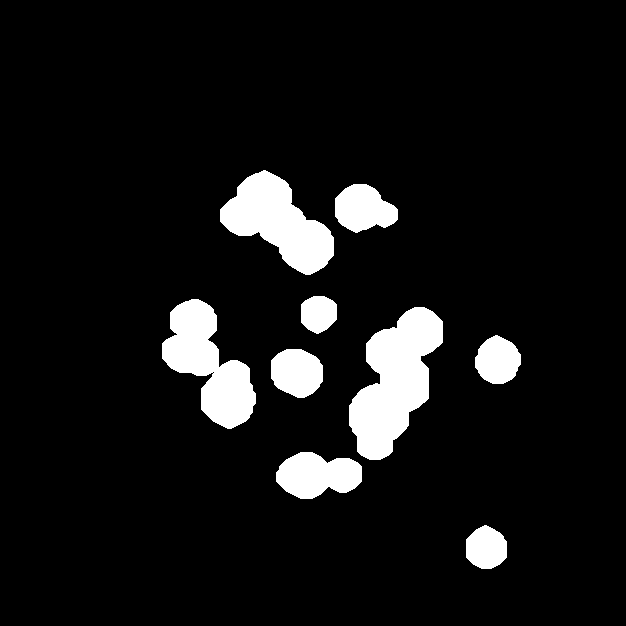
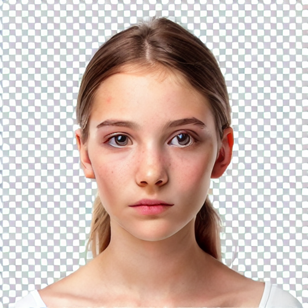

#  Acne Removal App (TransUNet + Stable Diffusion)

An end-to-end deep learning application that detects acne regions using **TransUNet segmentation** and removes them using **Stable Diffusion inpainting**.

---

##  Overview

This project combines **semantic segmentation** and **generative AI** to automatically identify and remove acne from facial images while preserving natural skin texture.

###  Pipeline

```
Input Image
 → TransUNet (Segmentation)
 → Acne Mask
 → Stable Diffusion Inpainting
 → Clean Image
```

---

##  Features

*  **Accurate Acne Detection** using TransUNet
*  **AI-based Image Restoration** via Stable Diffusion
*  **Interactive Controls**:

  * Confidence Threshold
  * Mask Dilation (Kernel + Iterations)
  * Guidance Scale
  * Inference Steps
  * Prompt Strength
*  **Download Options**:

  * Acne Mask
  * Final Output Image
*  **GPU Support (CUDA)** for fast inference
*  Clean UI using **Streamlit**

---

## Tech Stack

* **Python**
* **PyTorch**
* **Stable Diffusion (Diffusers)**
* **Albumentations**
* **OpenCV**
* **Streamlit**

---

##  Project Structure

```
project/
│
├── app.py              # Streamlit UI + inference pipeline
├── transunet.py        # Model architecture
├── best_model.pth      # Trained weights
├── requirements.txt
└── README.md
```

---

##  Setup

### 1️⃣ Clone Repository

```bash
git clone https://github.com/architk22/Acne-Removal-App.git
cd Acne-Removal-App
```

### 2️⃣ Install Dependencies

```bash
pip install -r requirements.txt
```

### 3️⃣ Download Model Weights

Download the trained model from:

👉 **[https://drive.google.com/file/d/1Dql_eke-RiX87OcVJSgJlJ-2Il_aaqz1/view?usp=sharing]**

Place it in the root directory as:

```
best_model.pth
```

---

##  Run the App

```bash
streamlit run app.py
```

Open in browser:

```
http://localhost:8501
```

---

## GPU Support

The app automatically uses GPU if available:

```python
DEVICE = "cuda" if torch.cuda.is_available() else "cpu"
```

---

## Results

| Input       | Mask        | Output      |
| ----------- | ----------- | ----------- |
|  |  |  |

---

## Key Insights

* Mask dilation significantly improves inpainting quality
* Prompt strength affects texture realism
* Guidance scale balances realism vs artifacts

---

## Future Improvements

* Real-time processing optimization
* Mobile/web deployment
* Automatic parameter tuning
* Face-aware segmentation refinement
